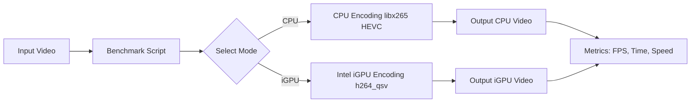

# Intel iGPU AI Video Benchmark: CPU vs IGPU (QSV)

  

## Abstract
This repository provides a comprehensive benchmark framework to compare **CPU encoding vs Intel iGPU (Quick Sync Video, QSV) hardware-accelerated encoding** using FFmpeg. The primary goal is to demonstrate the performance benefits of Intel iGPU for **AI/video processing workflows**, helping developers, researchers, and AI enthusiasts make informed decisions on hardware acceleration.

The benchmarks include:
- CPU-only HEVC encoding (`libx265`)
- Intel iGPU H.264 QSV encoding
- Frame rate, encoding speed, and time comparisons
- Optional monitoring of GPU utilization

---

## Objective
- Showcase Intel iGPU acceleration with **real-time AI/video workloads**
- Compare CPU vs hardware-accelerated encoding performance
- Provide a ready-to-run **benchmark script** for AI/video applications
- Educate on FFmpeg + Intel oneVPL integration

---

## Requirements
- **RHEL 9 / Fedora / Ubuntu** (x86_64) with Intel CPU + iGPU  
- **Intel Media SDK / oneVPL** installed  
- **FFmpeg** compiled with:
  ```bash
  --enable-libx265 --enable-gpl --enable-libvpl --enable-nonfree --enable-libmfx
```

* Sample video (`sample.mp4`) for testing
* `bc` installed for floating-point calculations in bash
```
---

## Workflow



> Optional: Run `sudo intel_gpu_top` during iGPU benchmark to monitor GPU usage.

---

## Installation & Setup

1. **Clone oneVPL (Intel Video Processing Library)**

   ```bash
   git clone https://github.com/oneapi-src/oneVPL.git
   cd oneVPL
   mkdir build && cd build
   cmake ..
   make -j$(nproc)
   sudo make install
   ```

2. **Compile FFmpeg with Intel QSV & HEVC support**

   ```bash
   git clone https://github.com/FFmpeg/FFmpeg.git
   cd FFmpeg
   ./configure --enable-libx265 --enable-gpl --enable-libvpl --enable-nonfree --enable-libmfx
   make -j$(nproc)
   sudo make install
   ```

3. **Place your test video**

   ```bash
   cp /path/to/your/video/sample.mp4 .
   ```

---

## Usage

### CPU Benchmark

```bash
./benchmark_qsv.sh sample.mp4 on-cpu
```

### Intel iGPU Benchmark

```bash
./benchmark_qsv.sh sample.mp4 on-igpu
```

### Output

* CPU: `output_cpu_hevc.mp4`
* Intel iGPU: `output_qsv_h264.mp4`
* Metrics printed: **Encoding time**, **FPS**, **Speed**, **Codec**

---

## Repository Structure

```
.
├── benchmark_qsv.sh       # Benchmarking script
├── sample.mp4             # Test video (ignored via .gitignore)
├── README.md              # This file
├── oneVPL/                # Intel oneVPL source
├── ffmpeg-qsv/            # FFmpeg source
└── .gitignore             # Ignore sample video
```

---

## License

This project is licensed under the **MIT License**.
See [LICENSE](LICENSE) for details.

---

## Notes

* Ensure your Intel CPU supports **Quick Sync Video** for iGPU encoding.
* Resolution and bitrate adjustments can be done in `benchmark_qsv.sh`.
* Suitable for **AI/data pipelines** requiring fast video encoding.

---

## Contributing

* Fork this repository
* Submit PRs for improvements in benchmark scripts or workflows
* Share performance results on different hardware

---

## Keywords

Intel iGPU, AI, Video Benchmark, FFmpeg, QSV, HEVC, CPU vs GPU, Hardware Acceleration

