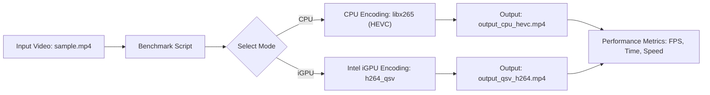

# Intel iGPU AI Video Benchmark: CPU vs iGPU (QSV)

  

## Abstract
This repository provides a benchmark framework to compare **CPU-only encoding vs Intel iGPU (Quick Sync Video, QSV) hardware-accelerated encoding** using FFmpeg.  

Many developers are unaware that modern Intel CPUs include a **dedicated GPU region (iGPU)** on the same die, designed specifically for parallel workloads like **video encoding, decoding, and AI acceleration**.  
By leveraging this, we avoid wasting CPU cycles on video tasks and free the CPU for **AI inference, business logic, or system workloads**.  

This benchmark focuses on **AI-driven video processing** such as:
- **CCTV surveillance**
- **Drone footage streaming**
- **Real-time face/object detection**  

where encoding speed directly impacts analytics performance.  


---

## Why CPU vs iGPU Matters

When the Intel **i915 driver** is loaded, video workloads are automatically offloaded to the **iGPU execution units (EUs)**, leaving the CPU free for other tasks.  
This prevents “CPU abuse” for video-related operations.  

### Architecture Overview

```text
+---------------------------------------------------+
|                  Intel CPU Package                |
|                                                   |
|   +-------------------+     +-----------------+   |
|   |   CPU Cores       |     |   iGPU (EUs)    |   |
|   | (General Compute) |     | (Video/Parallel |   |
|   |                   |     |   Workloads)    |   |
|   +-------------------+     +-----------------+   |
|                                                   |
+---------------------------------------------------+

         |                                 |
         v                                 v
   Regular apps                      Video/AI workloads
   (OS, DB, logic)                   (oneVPL, VAAPI, etc.)
         |                                 |
         v                                 v
       i915 driver  <--------------------> Kernel
````

---

## Benchmarks Include

* CPU-only HEVC encoding (`libx265`)
* Intel iGPU H.264 QSV encoding
* Frame rate, encoding speed, and time comparisons
* Optional GPU utilization monitoring (`intel_gpu_top`)

---

## Objective

* Show how Intel iGPU acceleration boosts **AI-powered video analytics**
* Demonstrate use cases:

  * **CCTV monitoring** (multiple live streams)
  * **Drone video feeds** (real-time transmission + detection)
  * **Face/License plate recognition**
* Compare **CPU vs hardware-accelerated encoding**
* Provide a **ready-to-run benchmark script**
* Educate on **FFmpeg + Intel oneVPL integration**

---

## Requirements

* **RHEL 9 / Fedora / Ubuntu** with Intel CPU + iGPU
* **Intel oneVPL** installed
* **FFmpeg** compiled with:

```bash
  --enable-libx265 --enable-gpl --enable-libvpl --enable-nonfree --enable-libmfx
```

* Sample video (`sample.mp4`) for testing
* `bc` installed for floating-point calculations

---

## Workflow



---

## Installation & Setup

1. **Clone and build oneVPL**

   ```bash
   git clone https://github.com/oneapi-src/oneVPL.git
   cd oneVPL
   mkdir build && cd build
   cmake ..
   make -j$(nproc)
   sudo make install
   ```

2. **Compile FFmpeg with Intel QSV**

   ```bash
   git clone https://github.com/FFmpeg/FFmpeg.git
   cd FFmpeg
   ./configure --enable-libx265 --enable-gpl --enable-libvpl --enable-nonfree --enable-libmfx
   make -j$(nproc)
   sudo make install
   ```

3. **Add a test video**

   ```bash
   cp /path/to/your/video/sample.mp4 .
   ```

---

## Usage

### CPU Benchmark

```bash
./benchmark_qsv.sh sample.mp4 on-cpu
```

### Intel iGPU Benchmark

```bash
./benchmark_qsv.sh sample.mp4 on-igpu
```

### Outputs

* CPU: `output_cpu_hevc.mp4`
* Intel iGPU: `output_qsv_h264.mp4`
* Metrics: **Encoding time, FPS, Speed, Codec**

---

## Why This Matters for AI

* **CCTV Surveillance** → more streams in real time
* **Drone Monitoring** → smoother low-latency AI analysis
* **Face/License Plate Recognition** → faster pipelines = quicker inference
* **Edge AI Devices** → CPU stays free for AI models

With Intel iGPU acceleration, you get **real-time AI performance** without buying dedicated GPUs.

---

## License

MIT License – see [LICENSE](LICENSE).

---

## Contributing

* Fork this repo
* Submit PRs for new benchmarks
* Share results from your **AI/CCTV/Drone workloads**

---

## Keywords

Intel iGPU, AI, Video Benchmark, FFmpeg, QSV, HEVC, CPU vs GPU, Hardware Acceleration, **CCTV Video Analytics**, **Drone AI**, **Face Detection**

