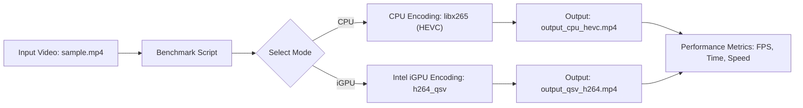

# Intel iGPU AI Video Benchmark: CPU vs iGPU (QSV)

  

## Abstract
This repository provides a comprehensive benchmark framework to compare **CPU encoding vs Intel iGPU (Quick Sync Video, QSV) hardware-accelerated encoding** using FFmpeg.  
The focus is on **AI-driven video processing workloads** such as **CCTV surveillance, drone footage streaming, and real-time face/object detection**, where encoding speed directly impacts analytics performance.  

The benchmarks include:
- CPU-only HEVC encoding (`libx265`)
- Intel iGPU H.264 QSV encoding
- Frame rate, encoding speed, and time comparisons
- Optional monitoring of GPU utilization

---

## Objective
- Demonstrate how Intel iGPU acceleration benefits **AI-powered video analytics**
- Showcase use cases like:
  - **CCTV monitoring** (multiple live streams)
  - **Drone video feeds** (real-time transmission + object detection)
  - **Face recognition systems** (fast encoding for inference pipelines)
- Compare **CPU vs hardware-accelerated encoding performance**
- Provide a ready-to-run **benchmark script** for AI/video developers
- Educate on **FFmpeg + Intel oneVPL** integration for AI-ready pipelines

---

## Requirements
- **RHEL 9 / Fedora / Ubuntu** (x86_64) with Intel CPU + iGPU  
- **Intel Media SDK / oneVPL** installed  
- **FFmpeg** compiled with:
  ```bash
  --enable-libx265 --enable-gpl --enable-libvpl --enable-nonfree --enable-libmfx
```

* Sample video (`sample.mp4`) for testing
* `bc` installed for floating-point calculations in bash
```
---

## Workflow



> Optional: Run `sudo intel_gpu_top` during iGPU benchmark to monitor GPU usage.

---

## Installation & Setup

1. **Clone oneVPL (Intel Video Processing Library)**

   ```bash
   git clone https://github.com/oneapi-src/oneVPL.git
   cd oneVPL
   mkdir build && cd build
   cmake ..
   make -j$(nproc)
   sudo make install
   ```

2. **Compile FFmpeg with Intel QSV & HEVC support**

   ```bash
   git clone https://github.com/FFmpeg/FFmpeg.git
   cd FFmpeg
   ./configure --enable-libx265 --enable-gpl --enable-libvpl --enable-nonfree --enable-libmfx
   make -j$(nproc)
   sudo make install
   ```

3. **Place your test video**

   ```bash
   cp /path/to/your/video/sample.mp4 .
   ```

---

## Usage

### CPU Benchmark

```bash
./benchmark_qsv.sh sample.mp4 on-cpu
```

### Intel iGPU Benchmark

```bash
./benchmark_qsv.sh sample.mp4 on-igpu
```

### Output

* CPU: `output_cpu_hevc.mp4`
* Intel iGPU: `output_qsv_h264.mp4`
* Metrics printed: **Encoding time**, **FPS**, **Speed**, **Codec**

---

## Why This Matters for AI

* **CCTV Surveillance**: Dozens of cameras → faster encoding = more streams handled in real time
* **Drone Monitoring**: Low latency encoding → smoother live streaming for AI object/terrain detection
* **Face/License Plate Recognition**: Faster video pipelines = quicker inference response times
* **Edge AI Devices**: Reduces CPU load → more resources available for **AI inference models**

Intel iGPU acceleration ensures **real-time AI performance without requiring expensive GPUs**.

---

## License

This project is licensed under the **MIT License**.
See [LICENSE](LICENSE) for details.

---

## Contributing

* Fork this repository
* Submit PRs for improvements in benchmark scripts or workflows
* Share performance results on **CCTV/Drone/AI datasets**

---

## Keywords

Intel iGPU, AI, Video Benchmark, FFmpeg, QSV, HEVC, CPU vs GPU, Hardware Acceleration, **CCTV Video Analytics**, **Drone AI**, **Face Detection**

